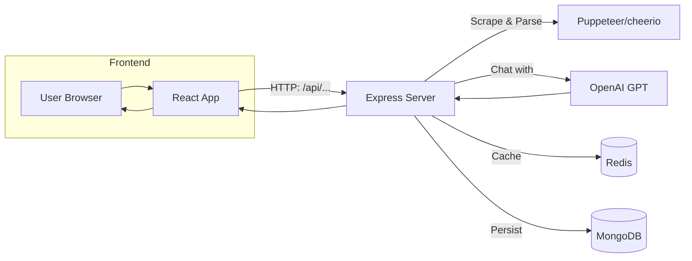

# PagePersonAI

Transform any webpage into your favorite writing style using AI-powered personas!
Turn dry content into entertaining narratives, clear summaries, or even whimsical stories—right in your browser. 🌐🤖

---

## Table of Contents

- [About](#about)
- [Features](#features)
- [Tech Stack](#tech-stack)
- [Architecture](#architecture)
- [Project Structure](#project-structure)
- [Getting Started](#getting-started)
  - [Prerequisites](#prerequisites)
  - [Installation](#installation)
  - [Running in Development](#running-in-development)
  - [Building for Production](#building-for-production)
- [API Reference](#api-reference)
- [Testing](#testing)
- [Linting & Formatting](#linting--formatting)
- [Deployment](#deployment)
- [Contributing](#contributing)
- [License](#license)

---

## About

PagePersonAI lets you paste a URL or text and choose from multiple AI “personas” (e.g., Hemingway, medieval knight, anime hero, ELI5) to re-tell or summarize the content in that style. It’s perfect for accessibility, creative inspiration, or just having fun with any article or blog post!

---

## Features

- **AI-Powered Transformations**: Send scraped content to OpenAI with persona-specific system prompts.
- **Auth0 Authentication**: Secure logins with Google, Apple, Magic Link, and more.
- **Usage Tracking**: Monitor per-user quotas and last-transformation timestamps.
- **Caching Layer**: MongoDB + optional Redis cache for faster repeat results.
- **Rate Limiting**: Configurable limits prevent abuse.
- **Modern UI**: React 18 + Vite + Tailwind CSS for a snappy, responsive experience.
- **Testing & Linting**: Vitest for unit tests, ESLint for code quality.

---

## Tech Stack

### Frontend (client/)

- **Framework**: React 18 with Vite
- **Language**: TypeScript
- **Styling**: Tailwind CSS
- **Auth**: Auth0 React SDK
- **Testing**: Vitest

### Backend (server/)

- **Runtime**: Node.js 18+ with Express
- **Language**: TypeScript
- **Database**: MongoDB via Mongoose
- **Cache**: Optional Redis
- **Auth**: JWT validation via Auth0
- **AI**: OpenAI GPT API
- **Rate Limiting**: express-rate-limit
- **Testing**: Vitest

---

## Architecture



---

## Project Structure

```text
PagePersonAI/
├── client/                # React + Vite frontend
│   ├── public/            # Static assets
│   ├── src/               # App source code
│   ├── tests/             # Vitest tests for components & hooks
│   ├── .env.example       # Copy to .env.local
│   ├── vite.config.ts
│   └── package.json
├── server/                # Express + TypeScript backend
│   ├── src/               # Controllers, models, routes, utils
│   ├── tests/             # Vitest tests for services & middleware
│   ├── dist/              # Compiled output (after `npm run build`)
│   ├── .env.example       # Copy to .env
│   ├── tsconfig.json
│   └── package.json
├── .env.example           # Combined reference for root-level scripts
├── start-dev.bat          # Windows shortcut to start both servers
└── README.md              # ← You are here!
```

---

## Getting Started

### Prerequisites

- **Node.js** ≥ 18
- **npm** ≥ 8 (or Yarn)
- **MongoDB** (local or cloud)
- **Auth0** account (Single Page App + API)
- **OpenAI** API key
- **(Optional)** Redis for advanced caching

---

### Installation

1. **Clone the repo**

   ```bash
   git clone https://github.com/yourusername/PagePersonAI.git
   cd PagePersonAI
   ```

2. **Set up environment files**

   ```bash
   # Root-level (for start-dev script)
   cp .env.example .env

   # Frontend
   cp client/.env.example client/.env.local

   # Backend
   cp server/.env.example server/.env
   ```

   Edit each `.env*` with your credentials (Auth0, OpenAI key, MongoDB URI, etc.).

3. **Install dependencies**

   ```bash
   npm install
   cd client && npm install
   cd ../server && npm install
   ```

---

### Running in Development

**Option 1**: Windows shortcut

```bash
start-dev.bat
```

**Option 2**: Manual

```bash
# In one terminal:
cd server
npm run dev         # compiles & starts Express on http://localhost:5000

# In another terminal:
cd client
npm run dev         # launches Vite dev server on http://localhost:5173
```

---

### Building for Production

```bash
# Build server
cd server
npm run build

# Build client
cd client
npm run build
```

- Serve **client/dist** on any static host (Netlify, Vercel, etc.).
- Start **server** in production mode:

```bash
cd server
npm start
```

---

## API Reference

### Authorization

All endpoints require:

```text
Authorization: Bearer <YOUR_JWT_TOKEN>
```

### POST `/api/transform`

- **Description**: Scrape and transform webpage content.
- **Body**:

```json
{
  "url": "https://example.com/article",
  "persona": "medieval-knight"
}
```

- **Response**:

```json
{
  "original": "<raw HTML or text>",
  "transformed": "<AI output>"
}
```

### GET `/api/personas`

- **Description**: List available personas (IDs, names, descriptions).

*(Explore other routes in `server/src/routes`!)*

---

## Testing

Run unit tests with Vitest:

```bash
# Server tests
cd server
npm run test

# Client tests
cd client
npm run test
```

Watch mode:

```bash
npm run test:watch
```

Generate coverage reports:

```bash
npm run test:coverage
```

---

## Linting & Formatting

```bash
# Lint server
cd server
npm run lint

# Lint client
cd client
npm run lint
```

*(We use ESLint flat config with Prettier integration—auto-fix with `eslint --fix`.)*

---

## Deployment

1. Configure environment variables in your hosting platform.
2. Build and deploy the **client** static files.
3. Deploy the **server** to your Node host (Heroku, AWS, DigitalOcean).
4. Update Auth0 Allowed Callback URLs and CORS origins to match your domains.

---

## Contributing

1. Fork this repo
2. Create a branch: `git checkout -b feature/amazing-idea`
3. Commit: `git commit -m "Add amazing idea"`
4. Push: `git push origin feature/amazing-idea`
5. Open a Pull Request

Please follow our coding standards and add tests for new features!

---

## License

This project is under a **Proprietary License**. See [LICENSE](LICENSE) for details.

---

## Acknowledgments

- **OpenAI** for GPT API
- **Auth0** for authentication services
- **Tailwind Labs** for Tailwind CSS
- The amazing open-source community

---

## New Service Architecture

The content transformation pipeline has been refactored into modular, testable services:

### Core Services

- **`ScraperService`** (`server/src/services/scraper.ts`)
  - Web content extraction with timeout and error handling
  - HTML parsing with cheerio
  - Metadata extraction (title, description, word count)
  - Configurable content length limits

- **`ParserService`** (`server/src/services/parser.ts`)
  - Content cleaning and normalization
  - Text validation and length enforcement
  - Word counting and summary generation
  - Unicode character handling

- **`PromptBuilderService`** (`server/src/services/promptBuilder.ts`)
  - Dynamic prompt construction based on personas
  - System and user prompt separation
  - Content type-specific prompt templates
  - Token length calculation

- **`OpenAIClientService`** (`server/src/services/openaiClient.ts`)
  - OpenAI API communication with comprehensive error handling
  - Configurable model parameters (temperature, tokens, penalties)
  - Usage tracking and response validation
  - Timeout and retry logic

- **`ContentTransformerService`** (`server/src/services/content-transformer.ts`)
  - Orchestrates the entire transformation pipeline
  - Coordinates between scraper, parser, prompt builder, and OpenAI client
  - Handles both URL and direct text input modes

### Configuration Management

- **Centralized Config** (`server/src/config/index.ts`)
  - Zod-based environment validation
  - Type-safe configuration access
  - Fail-fast on missing critical variables
  - Modular configuration exports for different services

### Shared Types

- **Type Packages** (`packages/types/`)
  - Shared interfaces between client and server
  - Prevents type drift and ensures API contract consistency
  - Centralized type definitions for `ApiResponse`, `Persona`, `WebpageContent`, etc.

### Enhanced Error Handling

- **Component Cleanup** - Hooks now handle component unmounts and prevent memory leaks
- **Abort Controllers** - In-flight requests can be cancelled
- **Safe State Updates** - Prevents "setState on unmounted component" warnings
- **Comprehensive Error Boundaries** - Better error recovery and user feedback

---

## Configuration

### Environment Variables

The application uses Zod for runtime environment validation. Critical variables include:

```bash
# Server Configuration
PORT=3001
NODE_ENV=development

# Database
MONGODB_URI=mongodb://localhost:27017/pagepersonai

# Auth0
AUTH0_DOMAIN=your-domain.auth0.com
AUTH0_CLIENT_ID=your-client-id
AUTH0_CLIENT_SECRET=your-client-secret
AUTH0_AUDIENCE=https://api.pagepersonai.com

# OpenAI
OPENAI_API_KEY=sk-your-key-here
OPENAI_MODEL=gpt-4

# Security
JWT_SECRET=your-super-secret-jwt-key-32-chars-min

# Rate Limiting
RATE_LIMIT_WINDOW_MS=900000
RATE_LIMIT_MAX_REQUESTS=100

# Usage Limits
DAILY_LIMIT_FREE=10
DAILY_LIMIT_PREMIUM=100

# Client URL for CORS
CLIENT_URL=http://localhost:5173
```

All environment variables are validated at startup. The server will exit with clear error messages if required variables are missing or invalid.

---
