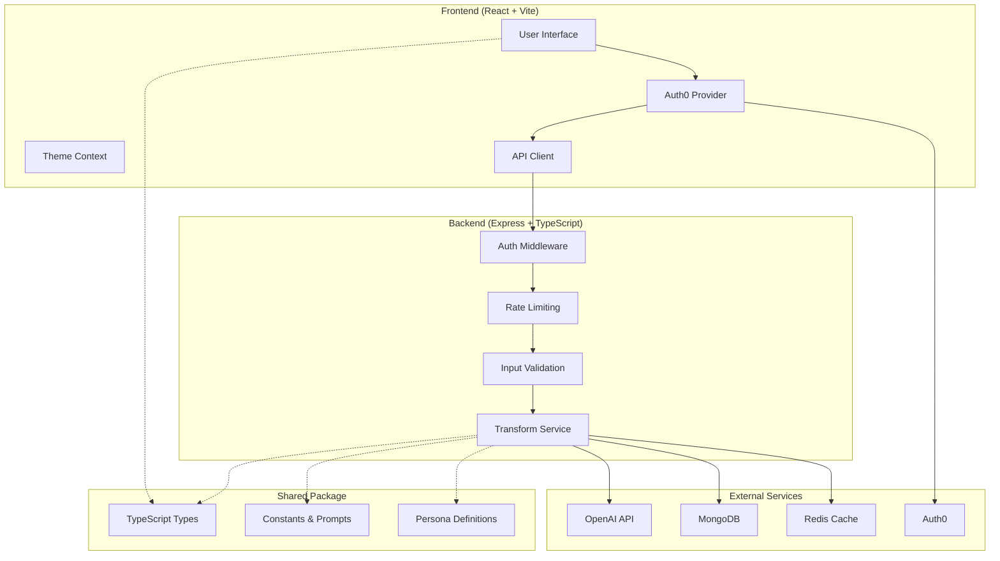

# PagePersonAI

Transform any webpage into your favorite writing style using AI-powered personas.  
Turn boring articles into engaging narratives, clear explanations, or creative stories.

[](https://typescriptlang.org/)
[](https://reactjs.org/)
[](https://nodejs.org/)
[](https://mongodb.com/)
[](https://openai.com/)
[](https://auth0.com/)
[](https://docker.com/)

---

## 🏗️ Monorepo Structure

This project is organized as a monorepo using **npm workspaces** for efficient dependency management and development workflow.

```
PagePersonAI/
├── package.json                 # Root package.json with workspace configuration
├── shared/                      # Shared types and constants
│   ├── src/
│   │   ├── types/              # TypeScript interfaces
│   │   └── constants/          # Shared constants (personas, prompts)
│   └── package.json
├── server/                      # Express.js API backend
│   ├── src/
│   │   ├── controllers/        # Route handlers
│   │   ├── middleware/         # Authentication, validation, etc.
│   │   ├── services/           # Business logic
│   │   └── utils/              # Utility functions
│   └── package.json
├── client/                      # React frontend
│   ├── src/
│   │   ├── components/         # UI components
│   │   ├── hooks/              # Custom React hooks
│   │   ├── contexts/           # React contexts
│   │   └── utils/              # Frontend utilities
│   └── package.json
└── docker-compose.yml           # Multi-container setup
```

### Workspace Benefits

- **Shared Dependencies**: Common packages like TypeScript, ESLint, and Prettier are hoisted to the root
- **Type Safety**: The `@pagepersonai/shared` package provides consistent types across client and server
- **Unified Scripts**: Run commands across all workspaces from the root
- **Efficient Development**: Changes to shared types are immediately available to all workspaces

---

## 🚀 Quick Start

### Prerequisites

- Node.js 18+ and npm 9+
- MongoDB instance (local or cloud)
- Redis instance (optional, for caching)
- OpenAI API key
- Auth0 tenant and application

### Installation

```bash
# Install all dependencies for all workspaces
npm install

# Build all workspaces
npm run build

# Run all tests
npm test

# Start development servers (server + client)
npm run start:dev

# Run linting across all workspaces
npm run lint

# Format all code
npm run format
```

### Individual Workspace Commands

```bash
# Work with specific workspaces
npm run build --workspace=shared
npm run test --workspace=server
npm run dev --workspace=client

# Or navigate to workspace directory
cd server
npm run start:dev

cd client
npm run dev
```

### Environment Setup

Create `.env` files in both `server/` and `client/` directories:

**server/.env**
```env
# Database
MONGODB_URI=mongodb://localhost:27017/pagepersonai
REDIS_URL=redis://localhost:6379

# OpenAI
OPENAI_API_KEY=your_openai_key_here

# Auth0
AUTH0_DOMAIN=your-domain.auth0.com
AUTH0_CLIENT_ID=your_client_id
AUTH0_CLIENT_SECRET=your_client_secret
AUTH0_AUDIENCE=https://api.pagepersonai.com

# Server
PORT=3001
NODE_ENV=development
```

**client/.env**
```env
# Auth0
VITE_AUTH0_DOMAIN=your-domain.auth0.com
VITE_AUTH0_CLIENT_ID=your_client_id
VITE_AUTH0_AUDIENCE=https://api.pagepersonai.com

# API
VITE_API_URL=http://localhost:3001
```

---

## What is PagePersonAI?

PagePersonAI reimagines web content through different writing personas. Want to read a technical article as if it were written by a medieval knight? Or understand complex topics through simple explanations? This tool makes it happen.

### Key Features

- **AI-Powered Transformations**: Uses OpenAI's GPT models with custom persona prompts
- **Multiple Personas**: ELI5, Medieval Knight, Anime Hacker, Plague Doctor, and Robot
- **Flexible Input**: Transform content from URLs or paste text directly  
- **Secure Authentication**: Auth0 integration with social logins
- **Usage Tracking**: Rate limiting and analytics with tier-based access
- **Smart Caching**: Redis-backed caching with MongoDB persistence
- **Modern Interface**: Responsive React UI with Tailwind CSS
- **Production Ready**: Docker containerization and CI/CD pipeline
- **Well Tested**: Comprehensive test coverage

---

## Architecture



---

## 🛠️ Development Workflow

### Making Changes

1. **Shared Types**: Update `shared/src/types/` and run `npm run build --workspace=shared`
2. **Server Changes**: Work in `server/src/` and use `npm run start:dev --workspace=server`
3. **Client Changes**: Work in `client/src/` and use `npm run dev --workspace=client`

### Testing

```bash
# Run all tests
npm test

# Run tests for specific workspace
npm run test --workspace=server
npm run test --workspace=client

# Run tests in watch mode
npm run test:watch --workspace=server
```

### Code Quality

```bash
# Lint all workspaces
npm run lint

# Format all code
npm run format

# Type check
npm run type-check --workspace=shared
```

---

## 🐳 Docker Deployment

### Development

```bash
# Start all services
docker-compose up

# Start specific services
docker-compose up frontend backend

# View logs
docker-compose logs -f backend
```

### Production

```bash
# Build production images
docker-compose -f docker-compose.yml -f docker-compose.prod.yml build

# Deploy
docker-compose -f docker-compose.yml -f docker-compose.prod.yml up -d
```

---

## 📦 Package Management

### Adding Dependencies

```bash
# Add to root (shared dev dependencies)
npm install -D eslint-plugin-example

# Add to specific workspace
npm install express --workspace=server
npm install react-router-dom --workspace=client

# Add to shared package
npm install zod --workspace=shared
```

### Workspace Scripts

The root `package.json` includes these workspace-aware scripts:

- `npm run build`: Builds all workspaces in dependency order
- `npm run test`: Runs tests across all workspaces
- `npm run lint`: Lints all workspaces
- `npm run start:dev`: Starts development servers
- `npm run clean`: Cleans build artifacts

---

## 🔧 Configuration

### TypeScript

Each workspace has its own `tsconfig.json` with proper references:

- **Root**: Orchestrates all workspace builds
- **Shared**: Compiles to `dist/` for consumption by other workspaces
- **Server**: References shared package, compiles to `dist/`
- **Client**: References shared package, Vite handles bundling

### Path Mapping

Both server and client are configured to import from the shared package:

```typescript
// In server or client code
import { ApiResponse, ErrorCode } from '@pagepersonai/shared';
import { getAllClientPersonas } from '@pagepersonai/shared';
```

---

## 🚀 Deployment

### Environment Variables

Make sure to set these in your production environment:

```bash
# Server
MONGODB_URI=mongodb://production-uri
REDIS_URL=redis://production-uri
OPENAI_API_KEY=prod-key
AUTH0_DOMAIN=prod-domain.auth0.com
AUTH0_CLIENT_ID=prod-client-id
AUTH0_CLIENT_SECRET=prod-client-secret

# Client (build time)
VITE_AUTH0_DOMAIN=prod-domain.auth0.com
VITE_AUTH0_CLIENT_ID=prod-client-id
VITE_API_URL=https://api.yourapp.com
```

### Build Process

```bash
# Build all workspaces
npm run build

# The build artifacts will be in:
# - shared/dist/
# - server/dist/
# - client/dist/
```

---

## 🧪 Testing

### Test Structure

```
shared/          # No tests (just types/constants)
server/src/
├── __tests__/           # Integration tests
├── services/__tests__/  # Unit tests for services
├── utils/__tests__/     # Utility tests
└── middleware/__tests__/ # Middleware tests

client/src/
├── __tests__/           # App-level tests
├── components/__tests__/ # Component tests
├── hooks/__tests__/     # Hook tests
└── utils/__tests__/     # Utility tests
```

### Running Tests

```bash
# All tests
npm test

# Watch mode
npm run test:watch --workspace=server

# Coverage
npm run test:coverage --workspace=server
```

---

## 📚 API Documentation

### Endpoints

- `POST /api/transform` - Transform content with selected persona
- `GET /api/health` - Health check
- `GET /api/user/profile` - User profile information
- `POST /api/user/sync` - Sync user data with Auth0

### Authentication

All API endpoints require a valid Auth0 JWT token in the Authorization header:

```bash
Authorization: Bearer <jwt_token>
```

---

## 🤝 Contributing

### Development Setup

1. Fork the repository
2. Create a feature branch
3. Make your changes
4. Ensure all tests pass: `npm test`
5. Ensure code is formatted: `npm run format`
6. Submit a pull request

### Code Style

- TypeScript strict mode enabled
- ESLint + Prettier for code formatting
- Conventional commits for commit messages
- Test coverage expected for new features

---

## 📄 License

This project is licensed under the MIT License. See the [LICENSE](LICENSE) file for details.

---

## 🙏 Acknowledgments

- OpenAI for the GPT API
- Auth0 for authentication services
- The open-source community for amazing tools and libraries

---

*Ready to transform web content? Get started with the installation guide above!*
